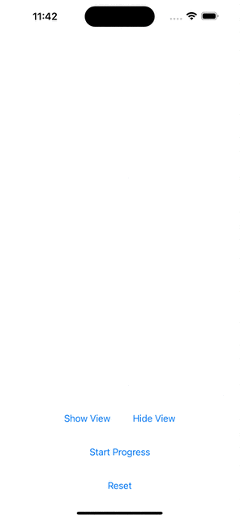

# DynamicProgressBar Example

DynamicProgressBar is a simple progress bar view integrated with dynamic island for iphones higher than model 14.

## Usage

Copy DynamicProgressBar view and paste in your code and you will have access to it. Check the ContentView.swift to check the example.

## Example

